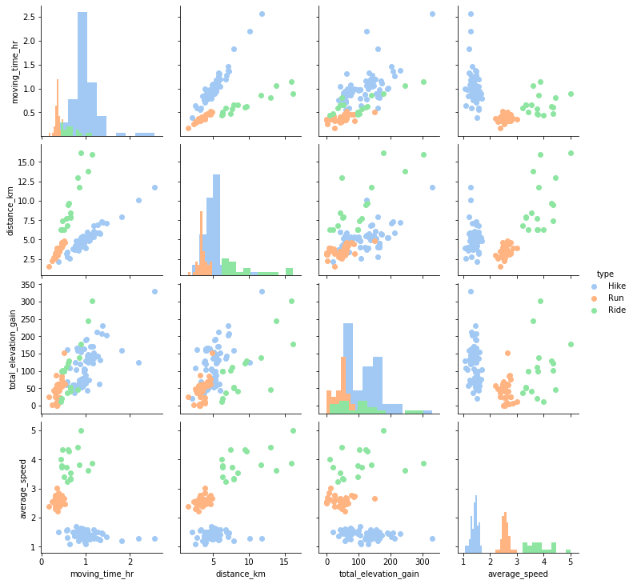
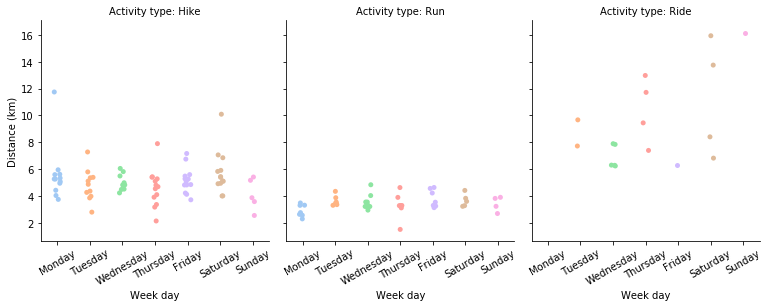

# Strava data analysis related code

This repo contains the code discussed in my blog: [Accessing user data via the Strava API using stravalib](https://medium.com/@mandieq/accessing-user-data-via-the-strava-api-using-stravalib-d5bee7fdde17)

>Interested in getting to your data from the Strava API? In this blog I walk through the process for accessing Strava user data using the stravalib python library;  followed by some preliminary analysis using the pandas and seaborn libraries.

## Some sample output

Data overview using seaborn pairgrid:

View of activity distance as split out by type and day of the week:

